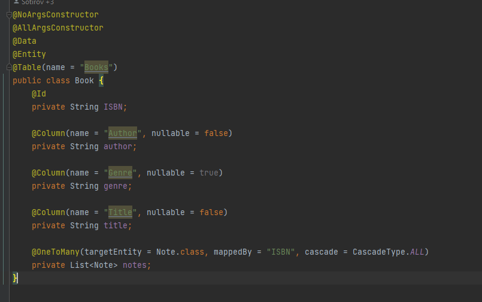

# Library Web

### Web application based on  Spring, Hibernate & Angular


### Изготвили:
- Атанас Миленов Иванов (ФН: 71937)
- Димитър Кирилов Сотиров (ФН: 71983)

### Преподаватели:
- Георги Минков
- Стоян Иванов
- & останалите готини хора от Dreamix


Гр. София

Летен семестър 2021/2022


## 1.Кратко описание на проекта и модулите в него
**Library Web** е уеб приложение играещо роля на библиотека за потребителите. В тази апликация, потребителят може да изпълнява функционалности, каквито извършва в истинска домашна библиотека - да си разглежда всички книги, да си избере някоя конкретна за която прочете повече, да добавя нови книги
и други.

**Back-End модули**

Backend-a е базиран на `Spring` и `Hibernate`. Направили сме стандартна файлова структура за Spring проект съдържаща:

 &nbsp;

- контролери - `BooksRestController` и `UsersRestController`, в които сме приложили най-важнитие принципи при писането на контролери като ползването на `Mapping`, връщане на `ResponseEntity` от всяка една CRUD операция; реализацията на операциите се осъществява благодарение на Book и User service-ите съответно, които сме описали по-надолу

 &nbsp;

- DTO-та - реализирали сме 3 data transfer objects (DTO) - `BookDto`, `NoteDto`, `UserDto`

- модели - основните модули, които са репрезентация на таблиците ни от базата в Spring приложението са `Book`, `User` и `Note`; тук е важно да споменем от какви полета се състои една книга - това са ISBN, който е уникалният идентификатор, автор на книгата, жанр, заглавие и бележки, които потребителят може да добавя към нея

 &nbsp;

- репозиторита - използвали сме `CrudRepository`-та както за книгите, така и за потребителите

```java
@Repository
public interface UserRepo extends CrudRepository<User, String> {
}
```
```java
@Repository
public interface Book extends CrudRepository<Book, String> {
}
```

- сървиси - имплементирали сме сървиси за `Book` и `User`, които използват съответните си репозиторита, за да променят, добавят и взимат данни от и в таблиците от базата

BookService:
```java
public interface BookService {
    List<Book> getAllBooks();
    Book getBook(String ISBN);
    BookDto addBook(Book book);
    BookDto updateBook(Book book);
    void deleteBook(String ISBN);
}
```

През `application.properties` сме нагласили връзката към базата от данни на `PostreSQL`. С помощта на Hibernate, при стартиране на приложението ни се създавт съответните бази, описани като модули по-горе и нашият сървър стартира.

 &nbsp;

**Front-End модули**

Frontend-а ни е базиран на `Angular`. Използвали сме стандартната структура от инициализирането на проект чрез `ng init`.

 &nbsp;

В основният ни `app-module` сме дефинирали нашите Route-ове, които сме използвали из цялото приложение - такива са зареждане на книги като таблица, със снимки и потробности за книгата.

```ts
const routes: Routes = [
  {
    path: '', redirectTo: 'books', pathMatch: 'full'
  },
  {
    path: 'books', component: BooksListComponent
  },
  {
    path: 'books-cards', component: BooksCardListComponent
  },
  {
    path: 'books/:isbn', component: ViewBookComponent
  }
];
```

- компоненти

1) `navbar` - навигацията в нашето приложение, важната част от нея са двата изгледа, които потребителят може да избере, за да вижда своите книги - като таблица или като картички (името + снимка на корицата на книгата) както и бутоните `Add Book` и `About Us`

 &nbsp;

2) `add-book` & `add-note` - форми, служещи са добавяне на съответно на книга и на бележка към съответна книга; дизайнът им е един и същ, както и употребата им, използвали сме `MatDialogRef`, който отваряме при натискане на бутоните Add Book/Note; при натискане на този dialogRef от навигацията зареждаме add-book компонента например

```ts
constructor(
    private readonly dialogRef: MatDialogRef<AddBookComponent>,
    private readonly bookService: BookService
  ) {}
```

 &nbsp;

3) `book-list` & `book-card-list` - основните компоненти, показващи книгите на потребителя под две форми - като таблица и като картички; при стартиране на двата компонента зареждаме данните от базата посредством `BookService`, и ги показваме в един от двата вида, спрямо toggle-a от навигацията

*Таблица:*
 &nbsp;

*Карти:*
 &nbsp;

4) `view-book` - подробно описание на избраната книга; всичките данни биват предадени посредсвтом събитието `click` на определената книга и биват заредени динамично, благодарение на `routerLink`, на който указваме идентификатора на книгата; 

```ts
<mat-card [routerLink]="['/books', book.isbn]" class="mat-elevation-z4">
```
този идентификатор след това използваме в `view-book`, посредством snapshot-a на избрания route

```ts
this.isbn = this.activatedRoute.snapshot.paramMap.get('isbn') || '';
```

- в подробния изглед на книгата можем да видим цялата информация за книгата, както и бележките към нея, които могат да се добавят посредством `Add Note`

Подробен изглед на книга:
 &nbsp;

5) `search` - search bar, който потребителят може да използва, за да търси по книгите по определен ISBN или име например
 &nbsp;

- модели - `Book`, `User` & `Note`

Book модел:
```ts
export interface Book {
  isbn: string;
  title: string;
  author: string;
  genre: string;
  notes: Note[],
}
```

- сървиси - `BookService` и `UserService`, които сме имплементирали чрез подаване на http client в конструктора, нужен за извикване на CRUD операциите

*BookService*
```ts
@Injectable({
  providedIn: 'root',
})
export class BookService {
  constructor(private readonly http: HttpClient) {}

  getBook(isbn: string): Observable<Book> {
    return this.http.get<Book>(`${environment.restApi}/books/${isbn}`);
  }

  createBook(book: Book): Observable<Book> {
    return this.http.post<Book>(`${environment.restApi}/books`, book);
  }

  getAllBooks(): Observable<Book[]> {
    return this.http.get<Book[]>(`${environment.restApi}/books`);
  }

  updateBook(isbn: string, updatedBook: Book): Observable<Book> {
    return this.http.put<Book>(
      `${environment.restApi}/books/${isbn}`,
      updatedBook
    );
  }

  deleteBook(isbn: string) {
    return this.http.delete(`${environment.restApi}/books/${isbn}`);
  }
}
```

## 2.Как да стартираме проекта

0) Проверяваме дали имаме инсталиран `git` на компютъра, отиваме в папка, където искаме да си дръпнем проекта и инициализираме гит посредством `git init`

1) Клонираме проекта локално 

```bash
git clone https://github.com/Werewolfgenesis/LibraryWeb.git
```

2) Стартираме Spring приложението

    - отваряме папката `library-web/` през IDE или текстов редактор, най-добре `IntelliJ`
    - проверяваме дали имаме изтеглени Java и настроена конфигурация за Spring в съответното IDe
    - настройваме си през `application.properties` данните за връзка с локална база през `PostgreSQL` :(
         &nbsp;

    - отваряме root файла на приложението `LibraryWeb` и натискаме стрелката за стартиране на сървъра
        
         &nbsp;

3) Стартираме Angular приложението

    - отваряме папката `client/` през IDE или текстов редактор

    - отиваме в папката  `LibraryWeb/client` (би трябвало да е автоматично при отваряне от предната стъпка)
    ```bash
    cd client
    ```

    - инсталираме пакетите чрез
    ```bash
    npm install
    ```

    - в гордния десен ъгъл трябва да ни намери `Angular CLI Server` конфигурация, която можем да стартираме и фронт енда да започне да работи на порт `localhost:4200`

         &nbsp;

## 3.Диаграма и описание на база

Използвали сме `PostgreSQL` за базата, в която пазим `books`, `users` и `notes` (скоро ще бъде добавена)

*таблици*

 &nbsp;

*книги - записи*

 &nbsp;