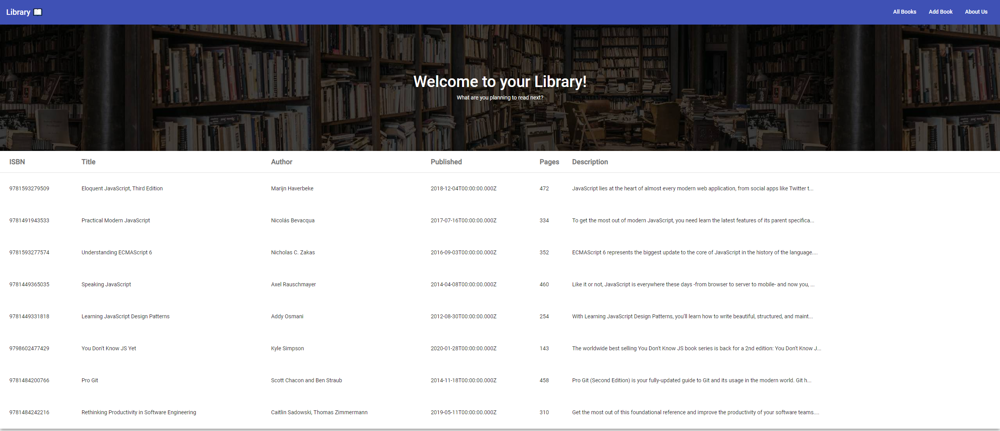
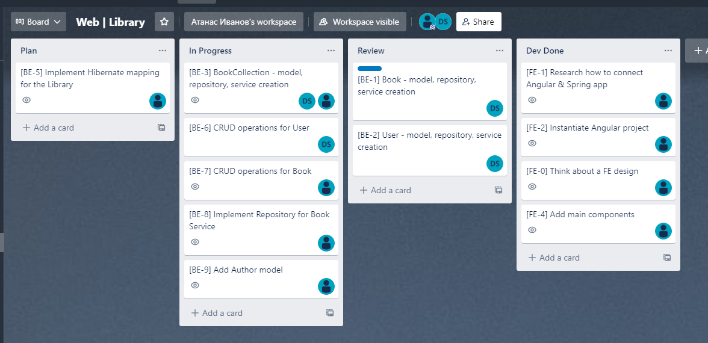

# Library Application

 &nbsp;&nbsp;&nbsp;&nbsp;&nbsp;&nbsp;&nbsp;&nbsp;&nbsp;&nbsp;&nbsp;&nbsp;&nbsp;&nbsp;&nbsp;&nbsp;&nbsp;&nbsp;&nbsp;&nbsp;&nbsp;&nbsp;&nbsp;&nbsp;&nbsp;&nbsp;&nbsp;&nbsp;&nbsp;&nbsp;&nbsp;&nbsp;

## Trello Board

 &nbsp;&nbsp;&nbsp;&nbsp;&nbsp;&nbsp;&nbsp;&nbsp;&nbsp;&nbsp;&nbsp;&nbsp;&nbsp;&nbsp;&nbsp;&nbsp;&nbsp;&nbsp;&nbsp;&nbsp;&nbsp;&nbsp;&nbsp;&nbsp;&nbsp;&nbsp;&nbsp;&nbsp;&nbsp;&nbsp;&nbsp;&nbsp;

# Library
Library application for managing and organising contacts. This is a project for the Web Technologies course in FMI, 2021/22.
## Packages

- **`client/`** - Front-End part of the project | 'Angular' and `Material UI`
- **`server/`** - Back-End part of the project | `Spring` and `Hibernate`

## Getting Started
These instructions will get you a copy of the project up and running on your local machine for development

## Technologies used
Used Java Spring for the backend with Hibernate for the persistence layer. For the Front-End we chose Angular framework.

## Developed By

* **Atanas Ivanov**
* **Dimitar Sotirov**

*FMI, Information Systems, 3rd Course*
